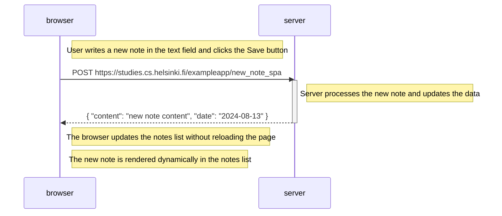

```mermaid
   sequenceDiagram
    participant browser
    participant server

    Note right of browser: User writes a new note in the text field and clicks the Save button

    browser->>server: POST https://studies.cs.helsinki.fi/exampleapp/new_note_spa
    activate server
    Note right of server: Server processes the new note and updates the data
    server-->>browser: { "content": "new note content", "date": "2024-08-13" }
    deactivate server

    Note right of browser: The browser updates the notes list without reloading the page
    Note right of browser: The new note is rendered dynamically in the notes list
```